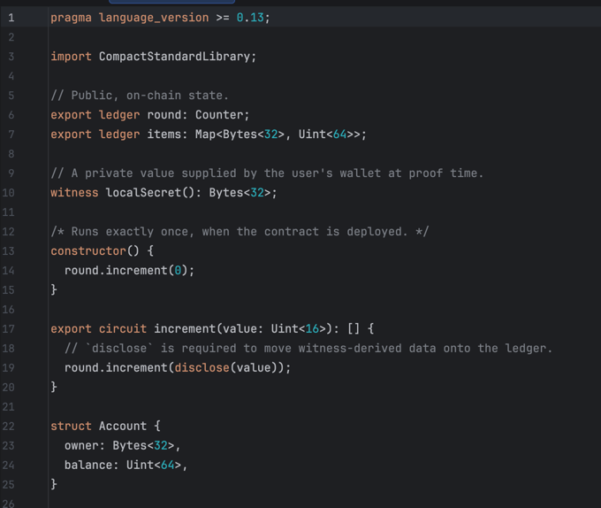

# Compact language support for IntelliJ

Syntax highlighting for the [Compact](https://docs.midnight.network/compact) smart
contract language (Midnight) in IntelliJ IDEA and other IntelliJ-based IDEs.

## Screenshot


## Features

- File type recognition for `.compact` files
- Highlighting of keywords (`circuit`, `witness`, `ledger`, `constructor`, `struct`,
  `enum`, `module`, `import`, `export`, `pragma`, `disclose`, `sealed`, `if`, `for`, …)
- Highlighting of built-in types (`Boolean`, `Field`, `Uint`, `Bytes`, `Vector`,
  `Opaque`, `Counter`, `Cell`, `Map`, `Set`, `List`, `MerkleTree`, `Maybe`, `Either`, …)
- String, number and boolean literals
- Line (`//`) and block (`/* */`) comments
- Brace / paren / bracket matching
- Comment/uncomment actions (`Cmd/Ctrl + /` and `Cmd/Ctrl + Shift + /`)
- Configurable colors under **Settings → Editor → Color Scheme → Compact**
- **Go-to-definition** for top-level declarations (`circuit`, `witness`, `ledger`,
  `struct`, `enum`, `module`): Ctrl/Cmd-click or Ctrl/Cmd-B jumps from a name usage to
  its declaration in the same file

## Project layout

```
build.gradle.kts                       Gradle build (IntelliJ Platform 2.x + Grammar-Kit)
settings.gradle.kts
src/main/jflex/.../Compact.flex        JFlex lexer (the highlighter's source of truth)
src/main/kotlin/.../                   Kotlin plugin classes
src/main/resources/META-INF/plugin.xml Plugin descriptor / extension registrations
src/main/resources/icons/compact.svg   File-type icon
src/main/gen/                          Generated lexer (created by the build; git-ignored)
examples/Counter.compact               Sample contract for eyeballing the highlighting
```

## Building

Requires **JDK 17+** (the Gradle toolchain will fetch one automatically if missing).

The repository does not ship `gradle/wrapper/gradle-wrapper.jar` (it is a binary).
Get a working wrapper in one of two ways:

1. **Open the folder in IntelliJ IDEA** — it imports the Gradle project and provisions
   the wrapper for you. Then use the Gradle tool window.
2. **From a terminal**, if you have any Gradle installed, run once:

   ```bash
   gradle wrapper --gradle-version 8.10.2
   ```

   After that, use `./gradlew` as normal.

Common tasks:

```bash
./gradlew generateLexer   # regenerate _CompactLexer from Compact.flex
./gradlew buildPlugin      # produce build/distributions/compact-intellij-0.1.0.zip
./gradlew runIde           # launch a sandbox IDE with the plugin installed
```

## Installing

Build the plugin, then in your IDE:

**Settings → Plugins → ⚙ → Install Plugin from Disk…** and pick
`build/distributions/compact-intellij-0.1.0.zip`.

## Customizing

- **Add keywords / types:** edit `src/main/jflex/com/midnight/compact/Compact.flex`,
  then rerun `./gradlew generateLexer` (the build does this automatically).
- **Change colors / categories:** edit `CompactSyntaxHighlighter.kt` (token → color
  mapping) and `CompactColorSettingsPage.kt` (the settings UI).
- **Target a different IDE version:** change `intellijIdeaCommunity("2024.2")` and
  `sinceBuild` in `build.gradle.kts`.

## How go-to-definition works

`src/main/grammar/Compact.bnf` is a deliberately *tolerant* Grammar-Kit grammar: it
recognizes top-level declaration headers (capturing each name as a navigable PSI
element) and treats every other token as filler, so unknown constructs never produce
parse errors. Identifier usages become reference elements; `CompactReferenceContributor`
attaches a `CompactReference` that resolves a usage to the matching declaration in the
same file. Regenerate the parser/PSI with `./gradlew generateParser` (the build runs it
automatically before compilation).

Resolution (in `CompactResolver`) is file-local and analyzes the lexer token stream with
brace/paren matching rather than a deep grammar. It resolves:

- **circuit / constructor parameters**, scoped to that circuit's body block (so the same
  parameter name in two circuits resolves independently);
- **`const` locals**, scoped to the enclosing block, use-after-declaration;
- **struct-field access** (`expr.field`), *type-aware*: the receiver's struct type is
  inferred from its declaration — parameters, annotated locals, and field chains like
  `a.b.c` — and the field is resolved within that struct (so two structs sharing a field
  name don't collide). When the type can't be determined, it falls back to any matching
  struct field;
- **top-level declarations** (circuit / witness / ledger / struct / enum / module) as a
  fallback.

Cross-file imports are still out of scope. Unresolved identifiers (library symbols,
types) use *soft* references, so they don't navigate but aren't flagged as errors.
